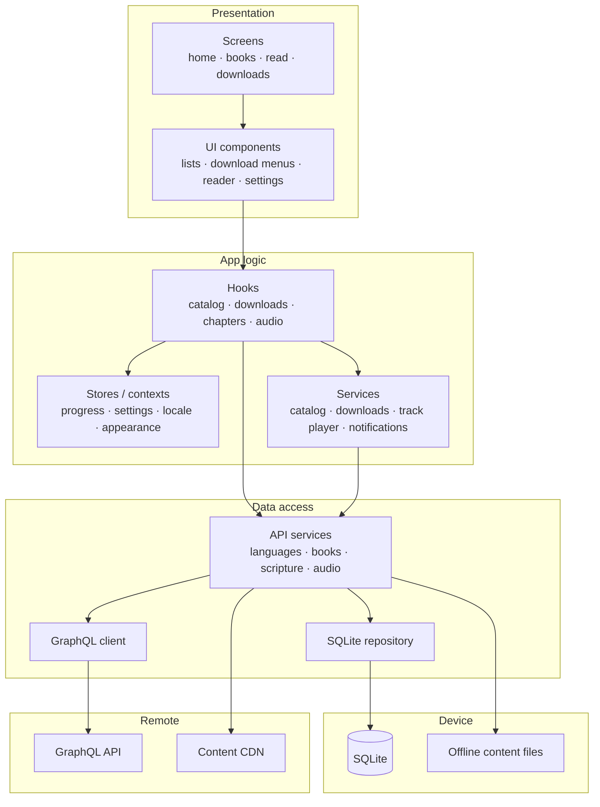
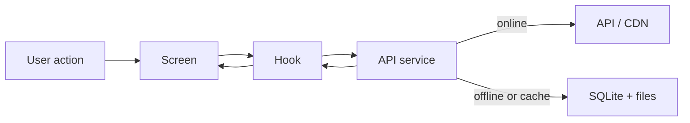
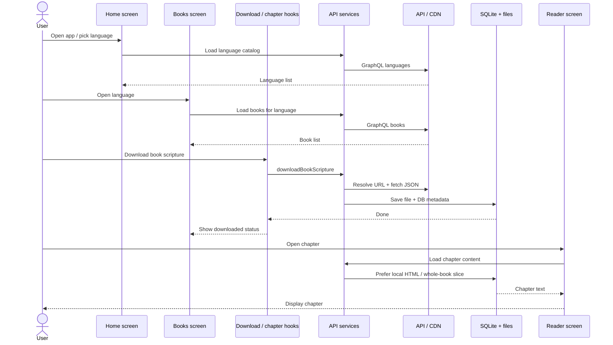

# Architecture design

High-level map of BIEL Mobile layers and main components.

Expo (SDK 55) + Expo Router. Routes live under `src/app/`. Deeper topics: [Offline mode](./offline-mode.md), [Downloads Library](./downloads-library.md), [Chapter audio](./chapter-audio.md).

## Layers

## What each layer owns

| Layer | Role | Main folders |
|-------|------|----------------|
| **Screens** | Navigation entry points | `src/app/` |
| **UI** | Lists, cards, menus, reader chrome | `src/components/` |
| **Hooks** | Screen data loading and download/playback UI state | `src/hooks/` |
| **Stores / contexts** | Session and preference state shared across screens | `src/stores/`, `src/contexts/` |
| **Services** | Cross-cutting runners (catalog cache, download jobs, audio player) | `src/services/` |
| **API services** | Domain operations: fetch, download, delete, resolve offline/online | `src/api/services/` |
| **GraphQL** | Remote catalog and content URL queries | `src/api/graphql/` |
| **DB** | Local metadata and indexes | `src/db/` |
| **Files** | Scripture HTML/JSON and audio MP3/CUE on disk | via `src/constants/offline-storage.ts` |

## Main screens

| Route | Screen | Purpose |
|-------|--------|---------|
| `/` | Home | Browse languages (catalog) |
| `/books` | Book list | Books and chapters for one language |
| `/read` | Reader | Scripture text and/or chapter audio |
| `/downloads-library` | Downloads Library | Local-only accordion of downloaded content |

Root layout (`src/app/_layout.tsx`) boots the database, offline root, i18n, track player, and notifications before showing the stack.

## Cross-cutting pieces

- **i18n** — `src/i18n/`, `src/locales/`
- **Theme / appearance** — `src/constants/theme.ts`, `src/contexts/appearance-context.tsx`
- **Types** — `src/types/`
- **Offline-first content** — API services try network for fresh data; SQLite + files serve when offline (see [Offline mode](./offline-mode.md))

## Request paths (simplified)

Downloads write metadata to SQLite and payloads to the file system. Reading and playback prefer local files, then fall back to the network when needed.

## Happy path example

Browse a language, download a book, then read a chapter.

1. **Home** loads the language catalog through hooks → API services → GraphQL.
2. **Books** loads that language’s book list the same way.
3. **Download** runs through download hooks and API services; the payload lands on disk and metadata in SQLite.
4. **Read** asks API services for the chapter; local storage is used when the book is already downloaded.
