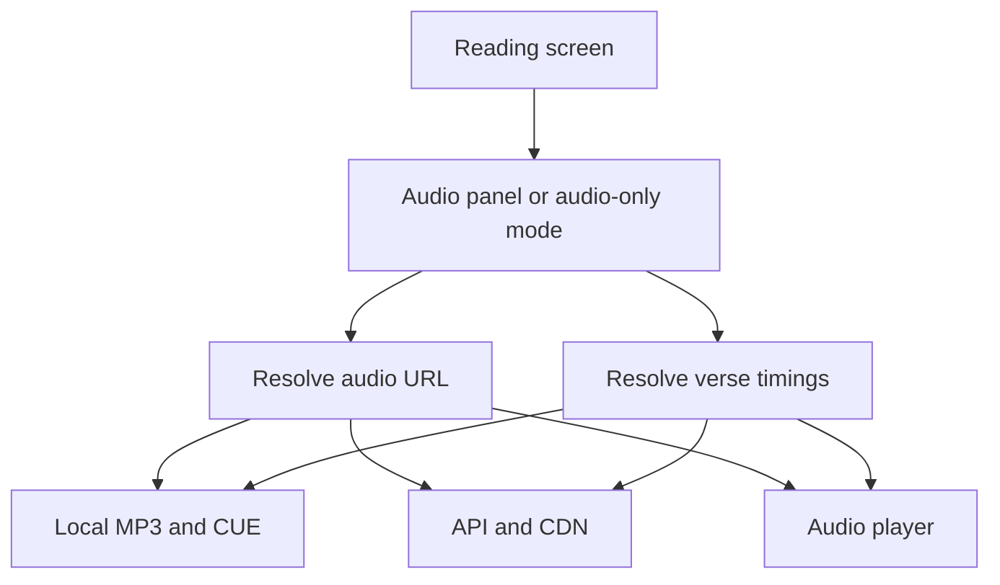
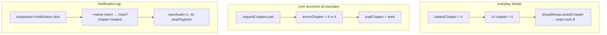

# Chapter audio — online and offline loading

How BIEL Mobile resolves, loads, and plays per-chapter audio in the reader.

See also: [Offline mode — architecture](./offline-mode.md) for where audio files are stored and how downloads work.

## Overview

Playback is **offline-first**: the app looks for a downloaded file on the device before asking the API for a streaming URL. Verse-level seek uses optional cue (timing) data, also resolved offline first.



## Where the user hears audio

### Text reader with audio panel

The user opens an optional panel from the reading screen. Audio loads only when the panel is open, for the chapter currently in view (or the chapter the user navigates to in the panel).

### Audio-only mode

Languages or books without text use a dedicated audio-only screen. Audio for the active chapter loads as soon as that screen is shown. The app also loads the list of chapters that have audio for next/previous navigation.

### Fallback when text is unavailable

If scripture cannot be loaded but audio for the requested chapter is on disk, the app switches to audio-only for that session instead of showing a text error.

## Resolving the audio file

| Step | Offline | Online |
|------|---------|--------|
| 1 | Look for `audio/ch-{n}.mp3` on disk | — |
| 2 | Confirm path from download metadata in the local database | — |
| 3 | — | Ask API for chapter MP3 URL, then stream from CDN |
| On network failure | Retry steps 1–2; if still missing, show that audio is unavailable offline | — |

The player receives either a local file URI or a remote URL; it does not download during playback.

## Verse timings (cue sheets)

Cue data maps timestamps to verses for skip-to-verse and highlight sync.

| Step | Offline | Online |
|------|---------|--------|
| 1 | Read local `audio/ch-{n}.cue` if present | — |
| 2 | — | Fetch cue URL from API, then download cue text from CDN |
| Result | Parsed verse start times | Same |

If cue data is missing, play/pause still works; verse stepping and sync are limited.

## Chapter list for navigation

To move between chapters in audio-only mode (or when advancing at end of a track):

1. Use chapter numbers from local download metadata and scanned audio files.
2. If online, use the API’s book audio manifest.
3. If the network fails but local audio exists, use the offline list only.

In the text reader, chapter boundaries for the audio panel follow the scripture chapter list the user is reading.

## Downloads vs playback

| Scope | What gets stored |
|-------|------------------|
| One chapter | That chapter’s MP3 and cue (if any) |
| Whole book | All chapters with audio for that book |
| Whole language | Audio for every applicable book in that language |

Downloading and playing are separate: downloads populate disk and the database; playback only reads what is already there.

## Background playback and media notification

On native platforms, chapter audio uses **react-native-track-player**. While audio is playing, the OS shows a media notification / lock-screen controls.

Tapping the notification opens `trackplayer://notification.click`. Expo Router cannot route that URI directly, so `src/app/+native-intent.tsx` intercepts it and redirects to the reading screen:

```
/read?languageCode=…&bookSlug=…&bookName=…&chapter=…&openAudio=1
```

The redirect uses the **currently loaded playback chapter** (`loadedChapter`), not the last scrolled chapter in the reader. That keeps audio playing when background autoplay has already advanced to the next chapter.

| User action | Expected behavior |
|-------------|-------------------|
| Tap media notification while audio is playing | Open reading view, open audio panel, keep playback running |
| Tap notification after leaving the chapter | N/A — playback was already stopped (see below) |

Relevant files:

| File | Role |
|------|------|
| `src/app/+native-intent.tsx` | Rewrites TrackPlayer notification URI to `/read` |
| `src/services/track-player/chapter-playback.ts` | Session state, `getActivePlaybackReadRoute()`, `getResumedPlaybackChapter()` |
| `src/services/track-player/setup.ts` | TrackPlayer setup and Android options |
| `src/hooks/use-stop-playback-on-leave.ts` | Stops audio when leaving the reading screen |

## When playback stops

Playback is intentionally **not** stopped when the user backgrounds the app while still on the reading screen (so the media notification remains useful). It **is** stopped in these cases:

| Scenario | How it is handled |
|----------|-------------------|
| Back to book list | `stopPlaybackBeforeLeave()` on toolbar back; `useStopPlaybackOnLeave()` on read-screen blur; `stopPlayback()` when books screen gains focus |
| App removed from recents (Android) | `AppKilledPlaybackBehavior.StopPlaybackAndRemoveNotification` in TrackPlayer setup |
| App backgrounded outside reading screen | `initPlaybackAppLifecycle()` stops playback when `readingScreenFocused` is false |
| Close audio panel | Pauses playback (panel closed); does not reset the TrackPlayer queue |

Relevant files:

| File | Role |
|------|------|
| `src/hooks/use-stop-playback-on-leave.ts` | Blur cleanup + `stopPlaybackBeforeLeave()` |
| `src/services/track-player/app-lifecycle.ts` | `AppState` listener; tracks whether read screen is focused |
| `src/components/reading/reading-toolbar.tsx` | Back button stops before `router.back()` |
| `src/components/reading/audio-only-toolbar.tsx` | Same for audio-only mode |
| `src/app/books.tsx` | Safety stop when book list gains focus |

## UI ↔ audio chapter sync

The reading UI (`activeChapter`, scroll position, verse highlight) and TrackPlayer (`loadedChapter`) can temporarily disagree. The app handles three cases:

### 1. Background autoplay advances ahead of the UI

When a chapter finishes, `handleQueueEnded` in the playback service loads and plays the next chapter. The reader may still show the previous chapter if the user switched away or has not scrolled.

**Rule:** Do **not** reload audio for the stale UI chapter. `shouldKeepLoadedChapter()` returns true only when `loadedChapter > chapter` (playback is ahead).

### 2. User-initiated chapter change

Prev/next at a chapter boundary, tapping a verse in another chapter, opening the panel on the scrolled chapter, or end-of-chapter autoplay in the panel all change the target chapter deliberately.

**Rule:** Always load the requested chapter. Call `requestChapterLoad(chapter)` before updating `activeChapter` so `useChapterAudio` does not treat the change as stale UI lag.

Flow:

1. `requestChapterLoad(chapter)` marks user intent
2. `setActiveChapter(chapter)` + `setSeekTarget({ chapter, position })`
3. `useChapterAudio` loads the chapter (if needed)
4. Seek effect runs when `loadedChapter === activeChapter`: seek to verse / first / last verse
5. Resume playback if it was playing before the step

### 3. Notification resume with chapter mismatch

If the user was viewing chapter 5, backgrounded the app, and autoplay reached chapter 6, tapping the notification must open chapter **6**, not 5.

**Rule:**

- Redirect URL uses `getResumedPlaybackChapter()` (`loadedChapter` first)
- `read.tsx` uses `effectiveChapterNumber` from the resumed chapter for scroll and panel state
- `markNotificationResume()` suppresses one `stopPlayback` during the read-screen remount
- `AudioPlayButton` initializes `activeChapter` from `loadedChapter` when `initialPanelOpen` is true



## Verse stepping at chapter boundaries

| Control | At last verse of chapter | At first verse of chapter |
|---------|--------------------------|---------------------------|
| **Next** | `seekToNextVerse()` fails → load next chapter, seek to start, resume if playing | Seek to next verse in chapter |
| **Previous** | Seek to previous verse in chapter | `seekToPreviousVerse()` fails (within restart threshold) → load previous chapter, seek to last verse, resume if playing |

The same logic applies in text-reader panel (`audio-play-button.tsx`) and audio-only mode (`use-audio-chapter-reader.ts`).

## Summary

| Concern | Offline | Online |
|---------|---------|--------|
| Audio file | Local MP3 | Stream from CDN URL from API |
| Verse timings | Local cue file | Cue from CDN via API |
| When audio is fetched (text reader) | When user opens audio panel | Same |
| When audio is fetched (audio-only) | When screen opens | Same |
| Chapter navigation list | Local + API manifest | API manifest, fallback to local |
| Media notification tap | — | Redirect to `/read` with `openAudio=1` |
| Stop on leave chapter | Always | Always |
| Stop on app kill (Android) | `StopPlaybackAndRemoveNotification` | Same |
| Chapter sync on resume | Use `loadedChapter` | Same |
