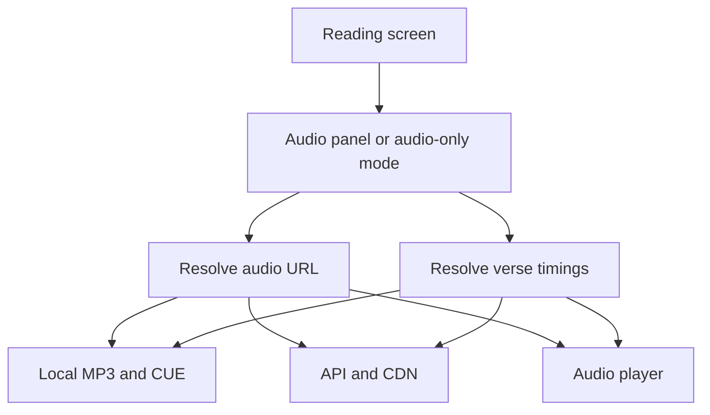

# Chapter audio — online and offline loading

How BIEL Mobile resolves, loads, and plays per-chapter audio in the reader.

See also: [Offline mode — architecture](./offline-mode.md) for where audio files are stored and how downloads work.

## Overview

Playback is **offline-first**: the app looks for a downloaded file on the device before asking the API for a streaming URL. Verse-level seek uses optional cue (timing) data, also resolved offline first.

## Where the user hears audio

### Text reader with audio panel

The user opens an optional panel from the reading screen. Audio loads only when the panel is open, for the chapter currently in view (or the chapter the user navigates to in the panel).

### Audio-only mode

Languages or books without text use a dedicated audio-only screen. Audio for the active chapter loads as soon as that screen is shown. The app also loads the list of chapters that have audio for next/previous navigation.

### Fallback when text is unavailable

If scripture cannot be loaded but audio for the requested chapter is on disk, the app switches to audio-only for that session instead of showing a text error.

## Resolving the audio file

| Step | Offline | Online |
|------|---------|--------|
| 1 | Look for `audio/ch-{n}.mp3` on disk | — |
| 2 | Confirm path from download metadata in the local database | — |
| 3 | — | Ask API for chapter MP3 URL, then stream from CDN |
| On network failure | Retry steps 1–2; if still missing, show that audio is unavailable offline | — |

The player receives either a local file URI or a remote URL; it does not download during playback.

## Verse timings (cue sheets)

Cue data maps timestamps to verses for skip-to-verse and highlight sync.

| Step | Offline | Online |
|------|---------|--------|
| 1 | Read local `audio/ch-{n}.cue` if present | — |
| 2 | — | Fetch cue URL from API, then download cue text from CDN |
| Result | Parsed verse start times | Same |

If cue data is missing, play/pause still works; verse stepping and sync are limited.

## Chapter list for navigation

To move between chapters in audio-only mode (or when advancing at end of a track):

1. Use chapter numbers from local download metadata and scanned audio files.
2. If online, use the API’s book audio manifest.
3. If the network fails but local audio exists, use the offline list only.

In the text reader, chapter boundaries for the audio panel follow the scripture chapter list the user is reading.

## Downloads vs playback

| Scope | What gets stored |
|-------|------------------|
| One chapter | That chapter’s MP3 and cue (if any) |
| Whole book | All chapters with audio for that book |
| Whole language | Audio for every applicable book in that language |

Downloading and playing are separate: downloads populate disk and the database; playback only reads what is already there.

## Summary

| Concern | Offline | Online |
|---------|---------|--------|
| Audio file | Local MP3 | Stream from CDN URL from API |
| Verse timings | Local cue file | Cue from CDN via API |
| When audio is fetched (text reader) | When user opens audio panel | Same |
| When audio is fetched (audio-only) | When screen opens | Same |
| Chapter navigation list | Local + API manifest | API manifest, fallback to local |
