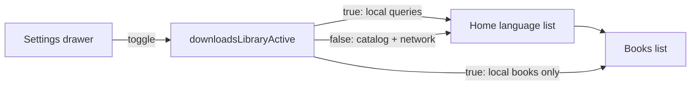

# Downloads Library — handoff

Session-level view of languages and books that already have local scripture and/or audio.

**Baseline:** `abd8554` (`library view`, 2026-08-15). Builds on `08a91d6` (`menu drawer for settings and downloads`), which added the drawer item as disabled.

See also: [Offline mode — architecture](./offline-mode.md) for storage layout, download flows, and what “downloaded” means on disk.

## Status

Shipped as a **filter over the existing home and books screens**, not a separate route or persisted preference.

| Done | Not done |
|------|----------|
| Toggle from the settings drawer | Dedicated `/downloads` (or similar) route |
| Home title switches to “Downloads Library” | Books screen title stays “Books” |
| Language list is local-only | Mode flag is in-memory; app restart returns to the full catalog |
| Book list is local-only (scripture and/or audio) | Library-specific empty copy (“No downloads yet”) |
| Toggle navigates back to home | Offline-only status overlay on the book list (see [Known gaps](#known-gaps)) |

Download and delete still use the same menus as browse mode. Opening a book/chapter still uses the reader.

## User flow

1. Open the settings drawer (home or books toolbar).
2. Tap **Downloads Library**. The item shows a selected background while the mode is on.
3. The app closes the drawer and returns to `/`. The home header title becomes **Downloads Library**. Search is cleared and the language list remounts.
4. Only languages with local content appear. Opening one shows only books with local scripture and/or audio.
5. Tap **Downloads Library** again to return to the full catalog. The same navigation-to-home behavior runs.

## Architecture

### Mode flag

`src/stores/downloads-library-store.ts` is a tiny external store (`useSyncExternalStore`):

- `useDownloadsLibraryActive()` — subscribe in UI/hooks
- `setDownloadsLibraryActive(boolean)` — set from the drawer

Default is `false`. Nothing writes it to disk or SecureStore.

Toggling from the drawer (`handleDownloadsLibraryPress` in `settings-drawer.tsx`):

1. Flip the flag.
2. Close the drawer.
3. `router.dismissTo('/')` when a stack can be dismissed, otherwise `router.replace('/')`.

Home (`src/app/index.tsx`) watches the flag and resets `listKey` plus the search query so the list does not keep stale rows.

### Data: languages

| Mode | Loader | Source |
|------|--------|--------|
| Catalog (default) | `loadLanguageCatalog` | Network catalog, with cached catalog + downloaded languages as offline fallback |
| Library | `loadDownloadedLanguagesCatalog` | `listLanguagesWithDownloads()` only — no GraphQL |

`useLanguages` branches on the flag for initial state, `refetch`, `refreshDownloadStatus`, and the load effect. Library mode does **not** use or update the in-memory catalog snapshot.

`listLanguagesWithDownloads` (`src/db/repository.ts`) returns `languages` rows that have at least one of:

- whole-book scripture (`books`)
- per-chapter scripture (`scripture_chapters`)
- audio (`audio_books`)

`hasText` is true if any scripture table **or** `book_catalog` has rows for that language. `hasAudio` is true if `audio_books` has rows.

After that query, library mode still runs `withDownloadStatus`, which sets the language card checkmark from **whole-book** counts (`books`) vs cached `book_catalog` counts — the same rule as browse mode. A language with only chapters or only audio stays `pending` on the card.

### Data: books

| Mode | Loader | Source |
|------|--------|--------|
| Catalog | `fetchBooksForLanguageOffline` then `fetchBooksForLanguage` | Cached catalog merged with whole-book downloads, then network |
| Library | `fetchDownloadedBooksForLanguage` | `listLocalContentBooksForLanguage()` only |

`listLocalContentBooksForLanguage` unions `books`, `scripture_chapters`, and `audio_books` for the language, grouped by `book_slug`, with `hasText` / `hasAudio` flags.

`useBooks` short-circuits both `refetch` and `refreshDownloadStatus` when the library is active. After a download/delete, it reloads the local list (so a book that lost all local content disappears) instead of patching a single row.

`listDownloadedBooksForLanguage` is **not** the library query. That helper is whole-book scripture (`books` table) and is still used by offline catalog merge and bulk-download slug fallback.

## Key files

| File | Role |
|------|------|
| `src/stores/downloads-library-store.ts` | Session flag |
| `src/components/settings/settings-drawer.tsx` | Toggle + selected state + navigate home |
| `src/app/index.tsx` | Title, search reset, list remount |
| `src/components/home/home-header.tsx` | Optional `title` override |
| `src/hooks/use-languages.ts` | Catalog vs library language load |
| `src/hooks/use-books.ts` | Catalog vs library book load |
| `src/services/language-catalog.ts` | `loadDownloadedLanguagesCatalog` |
| `src/api/services/books.ts` | `fetchDownloadedBooksForLanguage` |
| `src/db/repository.ts` | `listLanguagesWithDownloads`, `listLocalContentBooksForLanguage` |
| `src/locales/*.json` | `settings.menu.downloadsLibrary` |

## How to test

1. With no downloads, open **Downloads Library**. Expect the generic empty copy: “No languages found”.
2. Download scripture and/or audio for a language from the catalog, then open the library. That language should appear.
3. Open the language. Only books with local text and/or audio should appear. Testament tabs still filter OT/NT, so one tab can be empty.
4. Delete the last local content for a book (text and audio). After the download-status refresh, that book should leave the library list.
5. Toggle the menu item off. Full catalog returns; home title is the normal app title.
6. Force-quit the app while the library is on. On next launch, the catalog view should be back.

## Known gaps

These are the main follow-ups if the next change is to harden this view:

1. **Book list still hits the network for audio availability.** After `fetchDownloadedBooksForLanguage`, `useBooks` always calls `applyDownloadStatus` → `resolveLanguageAudioBooks` → GraphQL `LANGUAGE_AUDIO_FILES_QUERY`. That can delay the library book list online and fail open offline (`hasAudio` then stays at the local flag). Library refetch should skip that overlay or use local audio rows only.

2. **Language checkmarks ignore chapter-only and audio-only completeness.** `getDownloadedBookCountsByLanguage` counts `books` (whole-book scripture). Library language cards can look undownloaded even though they appear in the list.

3. **Mode is not persisted.** There is no deep link, restoration, or “stay in library after reading.”

4. **Empty states are generic.** Home uses `home.noLanguagesFound`; books uses `books.noBooksFound`. Neither mentions downloads.

5. **Books UI is unaware of the mode.** Title, testament tabs, download menus, and chapter expand are unchanged. Chapter lists still go through `useBookChapters` (offline-first, then API).

6. **`hasText` for library languages can be true from `book_catalog` alone** inside the SQL `CASE`, even though the `WHERE` already requires real content. Harmless for listing; can still send `hasText=1` into `/books` for an audio-heavy language that also has a cached catalog.

## Suggested next work

Priority depends on product intent. A practical order:

1. Stop calling `applyDownloadStatus` / `resolveLanguageAudioBooks` in library `useBooks` so the book list is local-only.
2. Add library empty-state strings.
3. Decide whether the flag should persist and whether the books header should say “Downloads Library”.
4. Optionally hide or simplify download affordances in library mode (manage/delete vs download-more).
