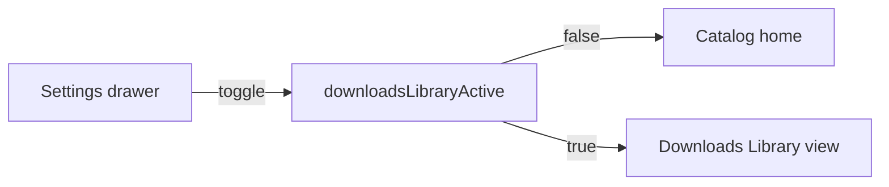

# Downloads Library

Dedicated, local-only view of languages and books that already have scripture and/or audio on the device.

See also: [Offline mode — architecture](./offline-mode.md) for storage layout, download flows, and what “downloaded” means on disk.

## Status

Shipped as a **session-level overlay on `/`**, not a separate route or persisted preference.

| Done | Not done |
|------|----------|
| Dedicated accordion UI (Figma Downloads Library) | Dedicated `/downloads` route |
| Languages expand to show local books | Mode flag is in-memory; app restart returns to the catalog |
| Content-type badges (Both / Text / Audio) | Badge variant `mixed` exists in tokens but is unused |
| Full chapter grid; chapters without local files are muted | Persist library mode across relaunch |
| Book search, content-type filter, OT/NT tabs | |
| Local-only list load (no catalog GraphQL overlay) | |

Delete still uses the existing scripture/audio download menu. Opening an available chapter uses the reader.

## User flow

1. Open the settings drawer and tap **Downloads Library**.
2. The app closes the drawer and returns to `/`. Home renders `DownloadsLibraryView` instead of the catalog.
3. **Back** (or tapping **Downloads Library** again in the drawer) turns the mode off and restores the catalog.

The library screen has its own chrome (Back, title, search, filter, testament tabs). The catalog language picker and menu are hidden while the mode is on; **Back** exits.

## Architecture

### Mode flag

`src/stores/downloads-library-store.ts` is an in-memory `useSyncExternalStore` flag:

- `useDownloadsLibraryActive()`
- `setDownloadsLibraryActive(boolean)`

Default is `false`. Nothing is written to disk.

The drawer (`handleDownloadsLibraryPress`) flips the flag, closes, then `dismissTo('/')` or `replace('/')`. `src/app/index.tsx` swaps between `DownloadsLibraryView` and `CatalogHomeScreen`.

### Data

`useDownloadsLibrary` loads everything from SQLite via `fetchDownloadedLibrary()`:

1. `listLanguagesWithDownloads()` — languages with any local scripture or audio
2. `listLocalContentBooks()` — books across those languages, from `books`, `scripture_chapters`, and `audio_books`

There is no GraphQL overlay and no `applyDownloadStatus` / `resolveLanguageAudioBooks` on this path.

`listDownloadedBooksForLanguage` is **not** the library query. That helper is whole-book scripture (`books` table) and is still used by offline catalog merge and bulk-download slug fallback.

`useLanguages` / `useBooks` still have leftover library branches from the first library-view commit. The accordion UI does not use them.

### Content-type badges

`getContentTypeIndicator` in `src/types/content-type.ts`:

| Indicator | When | Light colors |
|-----------|------|----------------|
| **Both** | Local text and audio | Purple `#fbf5ff` / `#a02af4` |
| **Text** | Scripture only | Green `#eefdf3` / `#00a63d` |
| **Audio** | Audio only | Blue `#eff6ff` / `#0885fe` |

Tokens live on `Colors` (`badgeBoth*`, `badgeText*`, `badgeAudio*`). `ContentTypeBadge` also has a **Mixed** (orange) mapping that is not assigned today.

The filter control can narrow the list to All, Scripture, Audio, or Both.

### Chapter grid

Expanding a book calls `fetchOfflineChaptersForBook`:

1. Collect local chapter numbers (scripture and/or audio).
2. Take `max(canonical Protestant chapter count, highest local chapter)`.
3. Mark each chapter `available` if it has local files.

Canonical counts are `BIBLE_BOOK_CHAPTER_COUNTS` in `src/constants/bible-books.ts`. Available cells are tappable and open the reader (audio-only books open audio-only mode). Unavailable cells are muted and disabled.

## Key files

| File | Role |
|------|------|
| `src/stores/downloads-library-store.ts` | Session flag |
| `src/components/settings/settings-drawer.tsx` | Toggle + selected state + navigate home |
| `src/app/index.tsx` | Catalog vs library swap |
| `src/components/download/downloads-library-view.tsx` | Screen chrome, search, filter, tabs |
| `src/components/download/downloads-library-list.tsx` | Language accordions |
| `src/components/download/downloads-library-book-row.tsx` | Book row, badge, delete menu |
| `src/components/download/content-type-badge.tsx` | Both / Text / Audio / Mixed pills |
| `src/hooks/use-downloads-library.ts` | Local languages + books |
| `src/hooks/use-library-chapters.ts` | Offline chapter grid load |
| `src/api/services/books.ts` | `fetchDownloadedLibrary` |
| `src/api/services/chapters.ts` | `fetchOfflineChaptersForBook` |
| `src/db/repository.ts` | `listLanguagesWithDownloads`, `listLocalContentBooks` |
| `src/locales/*.json` | `library` namespace |

## How to test

1. With no downloads, open **Downloads Library**. Expect “No downloads yet”.
2. Download scripture and/or audio from the catalog, then open the library. That language accordion should appear with the matching badge (Text, Audio, or Both).
3. Expand a book that has only some chapters. The full chapter grid should show; missing chapters are muted and not tappable.
4. Filter by Scripture / Audio / Both and search by book name. Testament tabs hide languages with no matching books.
5. Delete the last local content for a book. After refresh, that book should leave the list.
6. Tap **Back**. Catalog home returns. Force-quit while the library is open; on next launch the catalog is back.

## Known gaps

1. **Mode is not persisted.** No deep link or restore after process death. Reading a chapter keeps the flag for that session, so Back from the reader still lands in the library.
2. **`mixed` is unused.** The orange badge is wired in the component but `getContentTypeIndicator` never returns it (partial chapter mixes still show Text, Audio, or Both).
3. **Canonical chapter counts** may differ from a translation that adds extra chapters; the grid grows if local files go past the canon, but it will not shrink if a translation has fewer chapters than the Protestant count.
4. **Leftover `useLanguages` / `useBooks` library branches** are unused by the accordion screen.
