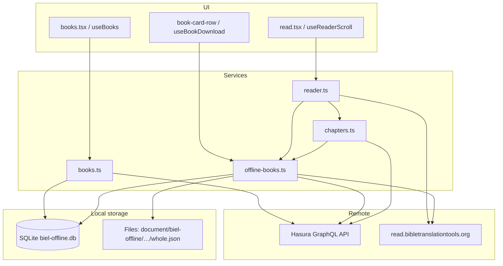
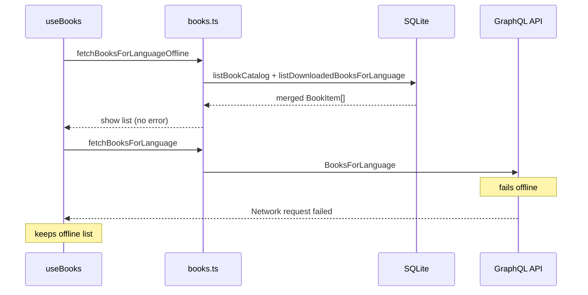

# Offline mode — database and backend logic

This document describes how BIEL Mobile stores downloaded scripture locally and serves it without a network connection.

## Overview

Offline scripture uses two storage layers:

| Layer | Technology | Purpose |
|-------|------------|---------|
| **Metadata** | SQLite (`expo-sqlite`, file `biel-offline.db`) | Languages, downloaded books, chapter lists, cached book catalog |
| **Content** | File system (`expo-file-system`) | `whole.json` per book (HTML chapters inside JSON) |

The GraphQL API at `https://api.bibleineverylanguage.org/v1/graphql` resolves URLs and metadata. Actual book text is fetched from `read.bibletranslationtools.org` (requires a specific `Referer` header — see [Content fetching](#content-fetching)).



## Bootstrap

On app start, [`src/app/_layout.tsx`](../src/app/_layout.tsx) runs:

1. `initDatabase()` — create SQLite schema if missing
2. `ensureOfflineRootExists()` — create `document/biel-offline/` if missing

## SQLite database

**Module:** [`src/db/`](../src/db/)  
**Database file:** `biel-offline.db` (app documents directory)  
**Schema:** [`src/db/schema.ts`](../src/db/schema.ts) — applied once at startup via `CREATE TABLE IF NOT EXISTS`

### Tables

#### `languages`

| Column | Type | Notes |
|--------|------|--------|
| `ietf_code` | TEXT PK | e.g. `fr`, `en` |
| `english_name` | TEXT | Optional |
| `national_name` | TEXT | Optional |
| `updated_at` | INTEGER | Unix ms |

Upserted when a book is downloaded. Referenced by `books.language_code` (FK, `ON DELETE CASCADE`).

#### `books`

One row per **downloaded** book (not the full API catalog).

| Column | Type | Notes |
|--------|------|--------|
| `id` | INTEGER PK | Auto-increment |
| `language_code` | TEXT | FK → `languages.ietf_code` |
| `book_slug` | TEXT | Canonical uppercase, e.g. `JUD` |
| `book_name` | TEXT | Display name |
| `resource_type` | TEXT | e.g. `ulb` |
| `content_name` | TEXT | Catalog path, e.g. `wa-catalog/fr_ulb` |
| `source_url` | TEXT | Remote `whole.json` URL used at download |
| `local_path` | TEXT | `file://` URI to `whole.json` |
| `byte_size` | INTEGER | Size of saved JSON |
| `downloaded_at` | INTEGER | Unix ms |

**Unique:** `(language_code, book_slug)`

#### `chapters`

Chapter numbers available offline for a downloaded book.

| Column | Type | Notes |
|--------|------|--------|
| `id` | INTEGER PK | |
| `book_id` | INTEGER | FK → `books.id` (`ON DELETE CASCADE`) |
| `chapter_number` | INTEGER | 1-based |

**Unique:** `(book_id, chapter_number)`

Populated when `whole.json` is parsed after download.

#### `book_catalog`

Cached **full book list** for a language (from a successful online `BooksForLanguage` query). Used to show the book selection screen offline.

| Column | Type | Notes |
|--------|------|--------|
| `language_code` | TEXT | Part of PK |
| `book_slug` | TEXT | Part of PK |
| `book_name` | TEXT | |
| `testament` | TEXT | `old` \| `new` |

**Primary key:** `(language_code, book_slug)`

Also updated via `upsertBookCatalogEntry` when a single book is downloaded (so that book appears offline even if the full catalog was never cached).

### Repository API

Public exports from [`src/db/index.ts`](../src/db/index.ts) / [`src/db/repository.ts`](../src/db/repository.ts):

| Function | Purpose |
|----------|---------|
| `initDatabase()` | Create tables/indexes if missing |
| `getBookDownloadRecord(languageCode, bookSlug)` | Single download row |
| `listDownloadedBookSlugs(languageCode)` | Slugs for download UI badges |
| `listDownloadedBooksForLanguage(languageCode)` | Full download records |
| `listBookCatalog(languageCode)` | Cached catalog → `BookItem[]` (errors → `[]`) |
| `replaceBookCatalog(languageCode, books)` | Replace all catalog rows for language |
| `upsertBookCatalogEntry(languageCode, book)` | Insert/update one catalog row |
| `upsertBookWithChapters(params)` | Save download + chapters + catalog entry |
| `deleteBook(languageCode, bookSlug)` | Remove DB rows (files deleted separately) |
| `getChapterNumbersForBook(languageCode, bookSlug)` | Ordered chapter numbers |

## File storage

**Module:** [`src/constants/offline-storage.ts`](../src/constants/offline-storage.ts)

```
{documentDirectory}/biel-offline/{languageCode}/{BOOK_SLUG}/whole.json
```

- `BOOK_SLUG` is normalized to **uppercase** (`normalizeBookSlug`).
- Download writes to `whole.json.tmp`, then moves to `whole.json` (atomic replace).
- Delete removes the whole book directory via `Directory.delete()`.

An in-memory cache (`wholeBookCache` in [`offline-books.ts`](../src/api/services/offline-books.ts)) maps `languageCode:BOOK_SLUG` → parsed chapters to avoid re-reading the file during a session.

## GraphQL API

**Client:** [`src/api/graphql/client.ts`](../src/api/graphql/client.ts)  
**Endpoint:** `https://api.bibleineverylanguage.org/v1/graphql`  
**Required header:** `User-Agent: Mozilla/5.0`

### Queries used for offline

| Query | File | Used for |
|-------|------|----------|
| `BookContent` | `BOOK_CONTENT_QUERY` | Whole-book download URL, size, resource type |
| `BooksForLanguage` | `BOOKS_FOR_LANGUAGE_QUERY` | Book list (online) + catalog cache |
| `ChaptersForBook` | `CHAPTERS_FOR_BOOK_QUERY` | Chapter grid when book not downloaded |
| `ChapterContent` | `CHAPTER_CONTENT_QUERY` | Online-only per-chapter HTML fallback |

### `BookContent` filters

Important predicates (see [`src/api/graphql/queries.ts`](../src/api/graphql/queries.ts)):

- `is_whole_book: true`
- `rendered_content.file_type: { _eq: "json" }` — excludes USFM and other non-JSON renderings
- `wa_content_metadata`: `show_on_biel: true`, `status: "Primary"`
- Language match via `language.ietf_code`

### Resource selection

[`src/api/services/resource-selection.ts`](../src/api/services/resource-selection.ts) — `pickRendering()`:

1. Drop `tq`, `tn` resource types.
2. Prefer resource types in order: **`ulb` → `udb` → `reg`**.
3. If multiple matches share a type, prefer `book_slug` matching the requested slug (case-insensitive).
4. For online chapter loads, also require `chapter != null`.

## Content fetching

[`src/api/services/content-fetch.ts`](../src/api/services/content-fetch.ts)

`read.bibletranslationtools.org` is behind Cloudflare. Requests without the correct referer return **403**. All CDN fetches use:

```ts
Referer: https://api.bibleineverylanguage.org/
User-Agent: Mozilla/5.0
Accept: application/json, text/html, */*
```

Used for:

- Downloading `whole.json` ([`offline-books.ts`](../src/api/services/offline-books.ts))
- Online chapter HTML ([`reader.ts`](../src/api/services/reader.ts))

## `whole.json` format and parsing

**Parser:** [`src/api/services/whole-book-parser.ts`](../src/api/services/whole-book-parser.ts)

Primary shape from WA Catalog:

```json
{
  "slug": "JUD",
  "label": "Jude",
  "chapters": [
    {
      "number": "1",
      "label": "1",
      "content": "<div id=\"ch-1\" class=\"chapter\">…</div>"
    }
  ]
}
```

`parseWholeBookJson()` returns `Map<chapterNumber, htmlString>`. The parser also supports legacy/alternate shapes (numeric keys, nested `content` objects, etc.).

Chapter HTML is passed to the same pipeline as online chapters: `buildChapterContentFromHtml()` → `parseChapterHtml()` in [`reader.ts`](../src/api/services/reader.ts).

## Backend services

### `offline-books.ts`

| Function | Behavior |
|----------|----------|
| `resolveBookContent` | `BookContent` query + `pickRendering` → URL, names, `file_size_bytes` |
| `getBookScriptureFileSizeBytes` | Remote size for download menu label |
| `downloadBookScripture` | Fetch JSON → parse chapters → write file → `upsertBookWithChapters` |
| `deleteBookScripture` | Delete directory + `deleteBook` + clear cache |
| `getOfflineChapterHtml` | Read `whole.json`, return HTML + `bookName` for one chapter |
| `getOfflineChapterNumbers` | Chapter list from SQLite if book is downloaded |
| `isBookDownloaded` | DB row exists and `whole.json` file exists |
| `loadWholeBookChapters` | Parsed map (with memory cache) |

**Download errors:**

- HTTP non-OK → `Failed to download book (status)`
- Invalid JSON / HTML / USFM body → specific error messages
- No chapters after parse → `Downloaded book has no chapters`

### `books.ts`

| Function | Behavior |
|----------|----------|
| `fetchBooksForLanguage` | Online list via GraphQL; on success, `replaceBookCatalog` |
| `fetchBooksForLanguageOffline` | `book_catalog` ∪ downloaded `books`; merge by slug |

### `chapters.ts`

`fetchChaptersForBook` — **offline-first:**

1. If downloaded → chapter numbers from SQLite.
2. Else → `ChaptersForBook` GraphQL query.

### `reader.ts`

`fetchChapterContent` — **offline-first:**

1. `getOfflineChapterHtml` → `buildChapterContentFromHtml` if local.
2. Else → `ChapterContent` query → fetch HTML URL → parse.

## UI integration

### Book list — `useBooks`

[`src/hooks/use-books.ts`](../src/hooks/use-books.ts)

**Offline-first load:**

1. Load `fetchBooksForLanguageOffline` immediately (show cached/downloaded books, clear error if any).
2. Try `fetchBooksForLanguage` (network).
3. On network success → replace list and refresh catalog cache.
4. On network failure → keep offline list; show error only if offline list is empty.

Download status (`pending` / `downloaded`) is merged via `listDownloadedBookSlugs`.

### Book download — `useBookDownload`

[`src/hooks/use-book-download.ts`](../src/hooks/use-book-download.ts)

- Shows `file_size_bytes` from GraphQL before download; local size after.
- `downloadBookScripture` with progress callback and `AbortController` cancel.
- `deleteBookScripture` on trash icon when book is downloaded.

### Route params

[`src/utils/route-params.ts`](../src/utils/route-params.ts) — `normalizeRouteParam()` ensures `languageCode` from expo-router is a single string (not `string[]`).

Used in [`src/app/books.tsx`](../src/app/books.tsx).

## End-to-end flows

### Download book (All Scripture)

```mermaid
sequenceDiagram
  participant UI as BookCardRow
  participant Hook as useBookDownload
  participant Off as offline-books
  participant GQL as GraphQL API
  participant CDN as read.bibletranslationtools.org
  participant DB as SQLite
  participant FS as File system

  UI->>Hook: startDownload
  Hook->>Off: downloadBookScripture
  Off->>GQL: BookContent query
  GQL-->>Off: whole.json URL + metadata
  Off->>CDN: GET whole.json (Referer header)
  CDN-->>Off: JSON body
  Off->>Off: parseWholeBookJson
  Off->>FS: write whole.json
  Off->>DB: upsertBookWithChapters + catalog entry
  Off-->>Hook: done
  Hook->>UI: refreshDownloadStatus
```

### Read chapter offline

```mermaid
sequenceDiagram
  participant UI as Reader
  participant Reader as reader.ts
  participant Off as offline-books
  participant FS as whole.json
  participant Parse as parseChapterHtml

  UI->>Reader: fetchChapterContent
  Reader->>Off: getOfflineChapterHtml
  Off->>FS: read + parse cache
  FS-->>Off: chapter HTML
  Off-->>Reader: html + bookName
  Reader->>Parse: buildChapterContentFromHtml
  Parse-->>UI: ChapterContent
```

### Open book list offline



## Key source files

| Path | Role |
|------|------|
| `src/db/schema.ts` | Table definitions |
| `src/db/repository.ts` | All SQL access |
| `src/constants/offline-storage.ts` | File paths |
| `src/api/graphql/queries.ts` | GraphQL query strings |
| `src/api/services/offline-books.ts` | Download / delete / offline chapter read |
| `src/api/services/books.ts` | Online + offline book list |
| `src/api/services/reader.ts` | Chapter content (offline-first) |
| `src/api/services/chapters.ts` | Chapter numbers (offline-first) |
| `src/api/services/content-fetch.ts` | CDN fetch headers |
| `src/api/services/resource-selection.ts` | ulb/udb/reg priority |
| `src/api/services/whole-book-parser.ts` | `whole.json` → chapter map |
| `src/hooks/use-books.ts` | Book list state |
| `src/hooks/use-book-download.ts` | Download UI state |

## Operational notes

- **Schema changes during development:** Uninstall the app or clear app storage to delete `biel-offline.db`, then relaunch. `CREATE TABLE IF NOT EXISTS` does not alter existing tables.
- **Catalog vs downloaded-only offline:** If the user never opened a language online after catalog caching existed, offline book list shows **downloaded books only** until a successful online `BooksForLanguage` fetch.
- **Web:** `expo-sqlite` on web may need extra Metro/COOP configuration; primary target is iOS/Android (Expo Go).
- **Audio:** Chapter audio is not part of this offline path; download menu “All Audio” is not wired to offline storage yet.

## Dependencies

- `expo-sqlite` (~55)
- `expo-file-system` (~55)

Configured in `app.json` (`expo-sqlite` plugin) and initialized from root layout.
