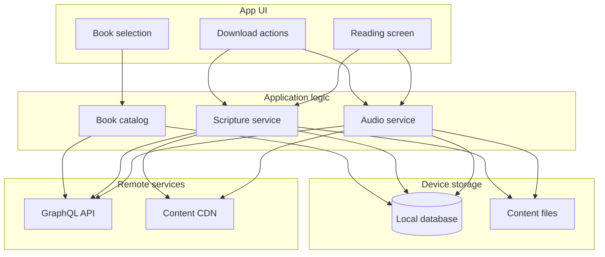
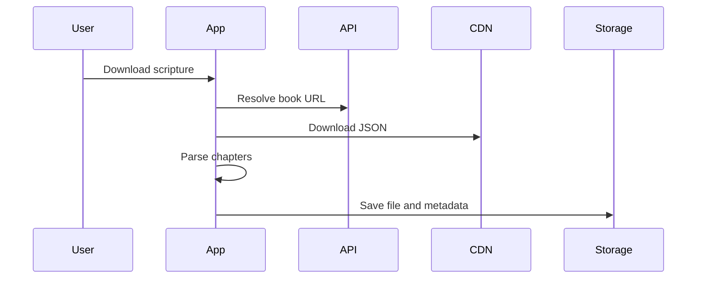
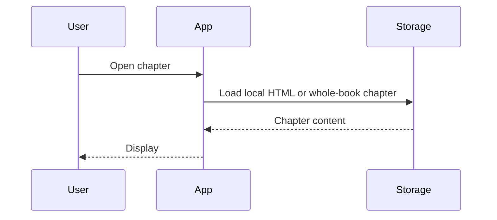

# Offline mode — architecture

How BIEL Mobile stores and serves scripture and audio without a network connection.

## Design principles

1. **Offline-first reads** — Local data is tried before the network.
2. **Two storage layers** — A local database for metadata and indexes; the file system for content payloads.
3. **Independent tracks** — Scripture and audio download, store, and delete separately.
4. **Two granularities** — Whole-book files or per-chapter files; reading and playback use whichever is available.

## System overview

On launch, the app initializes the database and offline content root.

The GraphQL API resolves URLs and catalog metadata. CDN requests must use the correct referer for the Bible translation tools host, or access is blocked.

## Local storage

### Content files

All offline content lives under a single app directory, organized by language and book:

| Path pattern | Content |
|--------------|---------|
| `whole.json` | Full book scripture (all chapters) |
| `scripture/ch-{n}.html` | One chapter of scripture HTML |
| `audio/ch-{n}.mp3` | Chapter audio |
| `audio/ch-{n}.cue` | Optional verse timing (cue sheet) |

Book identifiers are normalized to uppercase. Whole-book downloads write to a temporary file first, then replace the final file atomically. Deleting a book removes its entire directory.

Parsed whole-book content may be cached in memory for the session to avoid repeated disk reads.

### Database

The local database stores:

- **Languages** — touched when content is downloaded
- **Downloaded scripture** — whole-book records plus per-chapter records, with chapter indexes
- **Book catalog** — cached list of books per language for offline browsing
- **Downloaded audio** — per-book records and per-chapter file locations

The catalog table is not the same as “downloaded books”: it mirrors what was last fetched online. Offline book lists merge cached catalog entries with anything already on disk.

## Scripture

| Action | Behavior |
|--------|----------|
| Download whole book | Resolve URL from API → download JSON → parse chapters → save file and database rows |
| Download one chapter | Resolve chapter URL → save HTML file and database row |
| Read a chapter | Prefer per-chapter HTML, else extract from whole-book JSON |
| Chapter list | Use local indexes when any scripture exists for the book; otherwise fetch from API |

When multiple translation resources exist, the app prefers **ulb**, then **udb**, then **reg**. Whole-book downloads use JSON renderings only.

## Audio

Downloads can target a single chapter, an entire book, or all audio for a language. Metadata lives in the database; files live under each book’s `audio/` folder.

Playback is documented in [Chapter audio](./chapter-audio.md). Playback always checks local files before the network and does not trigger downloads.

## Reading experience

| Concern | Offline-first behavior |
|---------|------------------------|
| Book list | Show cached catalog immediately; refresh from network when possible |
| Chapter list | Local chapter numbers when available; otherwise API |
| Chapter text | Local HTML or whole-book slice; otherwise fetch from CDN |
| Chapter audio | See [Chapter audio](./chapter-audio.md) |

**Download UI:** The book card checkmark reflects whole-book scripture only. Audio and single-chapter scripture use separate controls in the download menu or reader.

## Core flows

### Download whole book

### Read chapter offline

### Book list without network

1. Load merged catalog and downloaded books from local storage.
2. Attempt network refresh in the background.
3. If the network fails, keep the local list; show an error only when nothing is stored locally.

## Operations

- **Schema changes:** Clearing app storage is required; existing databases are not migrated automatically.
- **Catalog offline:** If the user never synced a language online, only downloaded books appear until a successful online fetch.
- **Platform:** Primary target is mobile (iOS/Android); web may need extra setup for local database support.
