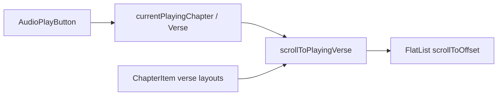

# Reading screen — audio auto-scroll

How the text reader keeps the **currently playing verse** visible while audio is playing.

See also: [Chapter audio](./chapter-audio.md) for playback, cues, and the audio panel.

## Overview

Auto-scroll is **scroll-only-when-needed**: if the playing verse is already inside a safe visible band, the list does not move. When the verse moves outside that band (or layout changes), `read.tsx` scrolls the chapter `FlatList` so the verse sits near the top of the viewport, above the audio panel.



## Key files

| File | Role |
|------|------|
| `src/app/read.tsx` | Owns scroll state, `scrollToPlayingVerse`, `FlatList`, and when scroll runs |
| `src/components/reading/chapter-item.tsx` | Measures verse Y positions and reports them via `onVerseLayout` |
| `src/components/reading/audio-play-button.tsx` | Drives `onCurrentVerseChange`, `onCurrentChapterChange`, panel height |

The reading list is an **inline `FlatList` in `read.tsx`**. Do not wrap it in a separate list component with aggressive virtualization (`removeClippedSubviews`, small `windowSize`, etc.) without re-validating auto-scroll.

## Playback state

`AudioPlayButton` updates React state in `read.tsx`:

- `currentPlayingChapter` — chapter number for the active cue
- `currentPlayingVerse` — verse number for the active cue
- `isAudioPanelOpen` — whether the panel is open (verse tap-to-seek is enabled when open)

Refs mirror this state (`currentPlayingChapterRef`, `currentPlayingVerseRef`) so `scrollToPlayingVerse` can read the latest values inside stable callbacks and `requestAnimationFrame` retries.

Highlighting in `ChapterItem` uses the same state: `highlightedVerse` when `item.chapter === currentPlayingChapter`.

## Verse position data (`verseLayoutsRef`)

Scroll needs each verse’s **Y offset within the scroll content**, not screen coordinates.

### How `ChapterItem` builds positions

1. **Layout callbacks** (`onLayout` on sections, paragraphs, and the sections container) record structural offsets.
2. **`onTextLayout` on each paragraph** parses line text to find where each verse starts (superscript + word-joiner marker). That yields a per-paragraph `Map<verseNumber, lineY>`.
3. **`reportVerseLayouts`** sums container + section + paragraph + line offsets into one `Map<verseNumber, y>` per chapter and calls `onVerseLayout(chapterNumber, verseToY)`.

`read.tsx` stores that map in `verseLayoutsRef: Map<chapter, Map<verse, y>>`.

### Chapter root ref

`getChapterRefSetter(chapter)` attaches the chapter block root `View` to `chapterViewRefsRef`. Scroll uses `chapterView.measureLayout` against the list’s native scroll view to get `chapterY` in content space.

### Text size changes

When `fontSize` or `lineHeight` changes, `ChapterItem` clears `verseLineYsRef` and re-reports layouts after `onTextLayout` runs again. `read.tsx` passes text-size fields in `FlatList` `extraData` so cells re-render, and re-runs scroll when sizes change.

## Scroll algorithm (`scrollToPlayingVerse`)

Implemented in `src/app/read.tsx`.

### 1. Resolve inputs

- Playing `chapter` and `verse` from refs
- `chapterView` from `chapterViewRefsRef`
- `verseY` from `verseLayoutsRef.get(chapter)?.get(verse)`

If the chapter view or verse Y is missing, retry up to **3** times on the next animation frame (layouts may not be ready yet).

### 2. Measure chapter in scroll content

```ts
const scrollRef = listRef.current?.getNativeScrollRef?.();
chapterView.measureLayout(scrollRef, (_x, chapterY) => { ... });
```

`verseAbsoluteY = chapterY + verseY` is the verse’s offset along the scrollable content axis.

### 3. Visible band

Tracked on scroll via `scrollYRef` and `viewportHeightRef` (from `FlatList` `onLayout`):

| Constant | Value | Meaning |
|----------|-------|---------|
| `TOP_PAD` | 60 | Top inset below toolbar |
| `PANEL_BUFFER` | 150 | Extra space above audio panel |
| `bottomPad` | `audioPanelHeightRef + PANEL_BUFFER` | Bottom inset |

```
visibleTop    = currentScroll + TOP_PAD
visibleBottom = currentScroll + viewportHeight - bottomPad
```

Scroll runs only if `verseAbsoluteY < visibleTop` or `verseAbsoluteY > visibleBottom`.

### 4. Apply scroll

```ts
listRef.current?.scrollToOffset({
  offset: Math.max(0, verseAbsoluteY - TOP_PAD),
  animated: true,
});
```

The target places the verse near the top safe area, not centered.

## When auto-scroll runs

| Trigger | Location |
|---------|----------|
| Playing verse or chapter changes | `useEffect` on `currentPlayingVerse`, `currentPlayingChapter`, `isAudioPanelOpen` |
| Text size or line height changes | `useEffect` on `fontSize`, `lineHeight` from `useReadingTextStyles()` |
| Verse layouts updated for playing chapter | `handleVerseLayout` → `requestAnimationFrame(scrollToPlayingVerse)` |
| Audio panel height changes | `AudioPlayButton` `onPanelHeightChange` |

`onScroll` updates `scrollYRef` only; it does not trigger auto-scroll by itself.

## Initial chapter scroll (separate from audio)

Opening a chapter uses `initialScrollIndex` and `scrollToIndex` / `scrollToOffset` so the requested chapter appears at the top. That path is independent of `scrollToPlayingVerse` and uses `didInitialScrollRef` to run once per navigation.

## Regression (commit `cd0c628`) and fix

### What broke

The text-size refactor introduced a scroll path that did not work end-to-end:

- `measureInWindow` on verse + list viewport refs that were **never wired** through `ReadingChapterList`
- Verse `Text` refs not passed to `ChapterItem`
- A separate list wrapper with **`removeClippedSubviews`** and tight **`windowSize`** / batching, which interfered with measurement

`scrollToPlayingVerse` then exited early, so the list stayed at the chapter top while audio advanced.

### What we kept

- **`measureLayout`** on the chapter root relative to the native scroll ref
- **`verseLayoutsRef`** from `ChapterItem` `onVerseLayout` (text layout + structural offsets)
- **Inline `FlatList`** in `read.tsx`
- **`extraData`** and layout refresh when text size changes
- Re-scroll when layouts update for the playing chapter

### Approaches to avoid without testing

- Scrolling from `measureInWindow` without a stable, attached viewport ref
- Relying on per-verse `Text` refs instead of `onTextLayout` layout maps
- Extracting the list into a heavily virtualized component without verifying refs and layout callbacks for off-screen chapters

## Debugging checklist

1. Confirm `currentPlayingVerse` / `currentPlayingChapter` update during playback.
2. Log or breakpoint `verseLayoutsRef.get(chapter)?.get(verse)` — should be a number after layout.
3. Confirm `chapterViewRefsRef.has(chapter)` after the chapter row mounts.
4. If scroll never fires, check early returns in `scrollToPlayingVerse` (missing layout, `viewportH <= 0`, verse already in band).
5. After changing text size, confirm `onTextLayout` re-runs and `handleVerseLayout` fires for the playing chapter.

## Related constants and hooks

- `useReaderScroll` — chapter list data, infinite scroll, initial index (not auto-scroll)
- `useReaderToolbar` — visible chapter for toolbar / download context
- `useReadingTextStyles` — font metrics; changes must invalidate verse layouts and `extraData`
